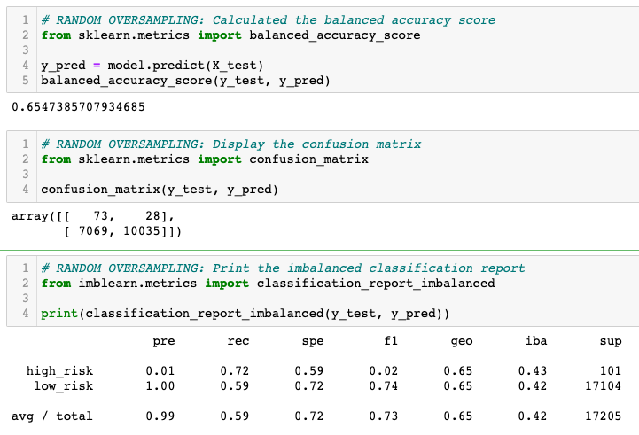
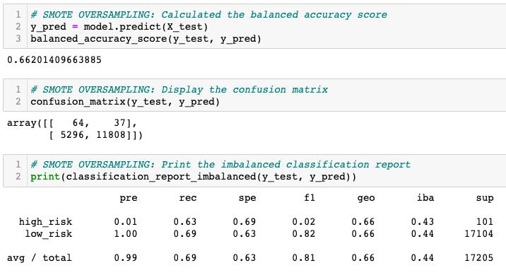
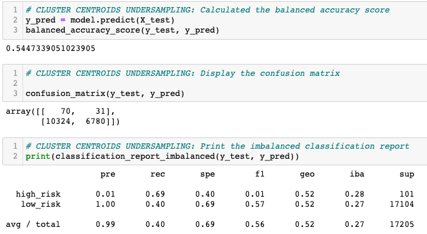
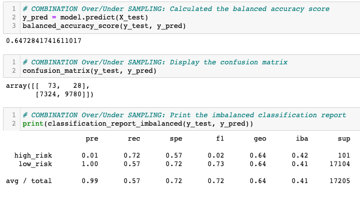
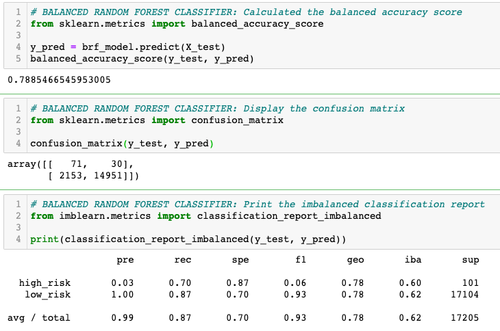
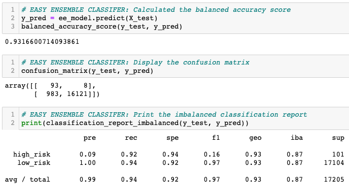

# Credit_Risk_Analysis

## Purpose:
Credit risk is an inherently unbalanced classification problem, as good loans easily outnumber risky loans. This project is intended to build and evaluate models using resampling to predict credit risk.

This project leverages the following libraries:
* imbalanced-learn
* scikit-learn

Six models were used:
1. Random Oversampling
2. SMOTE Oversampling
3. ClusterCentroids Resampler
4. SMOTEENN Combination Sampling
5. Balanced Random Forest Classifier
6. Easy Ensemble Classifier

## Results: 
The following images show the results for each model in these key areas:
* Balanced Accuracy
* Precision
* Recall (Sensitivity)

### **Random Oversampling**
<table><tr><td>
     
</td></tr></table>  

### **SMOTE Oversampling**
<table><tr><td>
  
</td></tr></table>  

### **ClusterCentroids Resample**
<table><tr><td>
  
</td></tr></table>  

### **SMOTEENN Combination Sampling**
<table><tr><td>
  
</td></tr></table>  

### **Balanced Random Forest Classifier**
<table><tr><td>
  
</td></tr></table>  

### **Easy Ensemble Classifier**
<table><tr><td>
  
</td></tr></table>  

#  Summary:
| Model | Accuracy | Precision | Recall | 
| --- | --- | --- | --- |
| Random Oversampling | 0.65 | High Risk: 0.01   Low Risk: 1.00  | High Risk: 0.72   Low Risk: 0.59   |
| SMOTE Oversampling | 0.66 | High Risk: 0.01   Low Risk: 1.00  | High Risk: 0.63   Low Risk: 0.69   |
| ClusterCentroids Resampler | 0.54 | High Risk: 0.01   Low Risk: 1.00  | High Risk: 0.69   Low Risk: 0.40   |
| SMOTEENN Combination Sampling | 0.64 | High Risk: 0.01   Low Risk: 1.00  | High Risk: 0.72   Low Risk: 0.57   |
| Balanced Random Forest Classifier | 0.78 | High Risk: 0.03   Low Risk: 1.00  | High Risk: 0.70   Low Risk: 0.87   |
| Easy Ensemble Classifier | 0.93 | High Risk: 0.09   Low Risk: 1.00  | High Risk: 0.92   Low Risk: 0.94   |

# Recommendation:

After reviewing the above summary table, the following observations can be derived:
1. The Accuracy of the (4) sampling methods is subpar to that of the (2) classification methods.
2. Precision is consistent with identifying Low Risk but is not great at High Risk across all (6) models.
3. Out of all of the models, Easy Ensemble Classifier performed the best Recall for identifying the High Risk borrowers.

Considering the observations, the Easy Ensemble Classifier method is the best performing. Additional tuning with this model could address the low precision rate for high risk borrowers.
